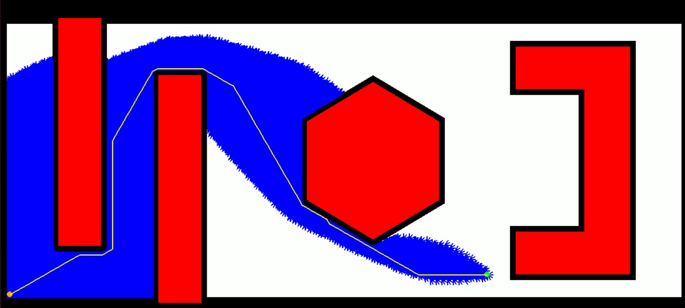

# A star Algorithm

## System requirements

1. python3

`sudo apt install python 3.11`

## Libraries used:

numpy

heapq

time

cv2

sys

pygame

## Instructions to run the code:

1. Run A_star_Anbarasan_ManojKumar.py

`python3 A_star_Anbarasan_ManojKumar.py`

2. Enter start_node, end_node, radius of the bot and clearance in the following order:

`Enter Start x coordinates:15`

`Enter Start y coordinates:15`

`Enter Start degrees:0`

`Enter End x coordinates:450`

`Enter End y coordinates:250`

`Enter End degrees:0`

`Enter radius of robot:5`

`Enter clearance of robot:5`

3. To change the step size value, go to the line 14 (by default the step size value is 10)

4. Once A_star_Anbarasan_ManojKumar.py is compilled A_star_Anbarasan_ManojKumar.mp4 will be generated in the same folder location

5. Run a_star_Anbarasan_ManojKumar.mp4 to see the generated video

## Legend

BLACK             --->          Clearance

WHITE             --->          Screen

RED               --->          Obstacle

ORANGE            --->          Start

GREEN             --->          Goal

BLUE              --->          Explored

YELLOW            --->          Final Path

## Example Image for Node from Start(15, 15, 0) to Goal(850,50,0)

## Github link:

https://github.com/manojkumar1119/ENPM661/blob/main/Project3-Phase1

## Authors:

Manoj Kumar Selvaraj (120511257) 

Directory Id:manojs

Anbarasan Kandasamy  (120270697) 

Directory Id:anbuk

